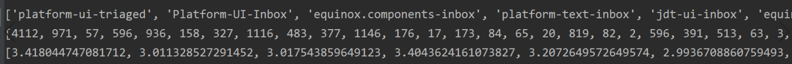

# 《软件需求工程》实验报告

* 小组成员及分数比例： </br> 

  罗沁禹 171860537---25% </br>

  魏宇阳 181860108---25% </br>

  罗树汉 181860062---25% </br> 

  赵宇鹏 181860146---25% </br>

* 小组分工： </br> 
罗沁禹：方法一：机器学习 </br> 
魏宇阳：方法二：按权重排序 </br> 
罗树汉：方法效果验证 </br> 
赵宇鹏：整理实验报告 </br> 

* 实验名称：软件需求的优先级排序

* 项目地址：https://github.com/wego1236/SREE

## 实验目的
    为软件需求进行优先级排序。

## 实验背景

    在软件开发维护生命周期中，常常有多个需求同时提交给软件开发维护团队。由于资源受限，软件团队往往无法同时满足所有需求的实现。因此，为需求进行优先级排序，有利于有限资源的合理分配。

## 理论知识

软件需求优先级，理论上来说是根据软件产品需求的价值进行排序。在需求优先级排序之后，才能进入真正的需求推进、落地执行的阶段。</br>

目前定义需求优先级暂时有这七个方法：
* KANO模型法：基本型需求>期望型需求>兴奋型需求
* 矩阵分析法：重要且紧急>重要不紧急>紧急不重要>不重要也不紧急
* 经济收益法：经济收益高且紧迫的功能需求  ＞ 经济收益高但不紧迫的功能需求  ＞ 紧迫但经济收益不高的功能需求  ＞ 不紧迫且经济收益不高的功能需求
* 前/后置需求分析法：前置需求的优先级  ＞ 后置需求的优先级；前置需求的重要性和紧迫性  ＞ 后置需求的重要性和紧迫性
* 满足核心用户需求的优先（二八原则）
* 满足核心业务的需求优先（资源最大化利用）
* 满足核心业务的投入产出比最大的需求优先（ROI最大化）

我们将在实验中探索和寻找新的软件需求优先级排序方法并予以验证。
</br>
</br>
</br>


## 实验内容

### 1.方法一：机器学习

#### `数据获取`

a) bugZilla上每个bug report都放在单独的html中，所以首先需要获取所有bug report的url。Bug List.html是bugZilla提供的bug report搜索页面，用BeautifulSoup从中解析出所有bug report的url，保存在htmlList.txt中。

b) 遍历htmlList.txt中的所有url，爬取bug report的以下几个属性：status, alias, version, product, component, hardware, importance, priority, assignee, 并保存在bugSample.csv中

以上代码在bugZilla crawl.py中实现

#### `数据预处理`

a) 首先人工地删去了一些明显无用的属性，包括alias（几乎全是None），version（无意义），assignee（几乎每个bug report都不相同）。此外，importance原本是由两个独立的属性组成的，一个是priority，一个是severity。然而，经过统计发现几乎所有的priority都是P3，为了防止出现样本偏差，importance中的priority不在模型训练范围内。

b) 删去不必要的属性后，需要对属性值数值化，将每个属性的不同属性值分别编码为整数，再进行训练。数值化后的数据保存在bugSample_encoded.csv

#### `训练模型`

分别使用了朴素贝叶斯，决策树，随机森林，多层感知机，支持向量机，使用5折交叉验证法进行训练。结果如下所示：

| Classifier | accuracy |
| :------| :------|
| Naive Bayes | 0.62 |
| Decision Tree | 0.58 |
| Random Forest | 0.64 |
| MLP | 0.66 |
| SVM | 0.63 |

```c
一些重要的模型参数：

决策树：使用基尼系数

随机森林：森林大小为5，使用基尼系数

多层感知机：激活函数：Relu，学习率：0.001，隐藏层：100层，优化算法：adam

支持向量机：核函数：rbf
```

</br>
</br>
</br>

### 2.方法二：按权重排序

#### `数据获取`

首先访问eclipse缺陷报告网站，网址：https://bugs.eclipse.org/bugs 。在该网址以”bug”为关键字进行搜索，获得一个只显示1000条数据的搜索结果。点击页面下方链接： See all search results for this query.

进入显示了全部搜索结果的网页。由于该网页将所有搜索结果放在一页，导致这个网页非常庞大，使用request库爬取一直失败，于是在浏览器中把该网页下载到了工作目录下。该网页占43MB。

#### `数据处理`

下载下来的实际上依然是很长的html代码，还没有将每一条bug及其附带的信息提取并保存起来。因此我使用了python的BeautifulSoup库对该html文件进行了处理，从表格中提取出每条bug存入字典数组（数组的每一条目是一个字典）。字典的格式就是bug的 “属性” : 属性值。循环内部关键代码如下，实际上就是对每一条提取出各个属性插入到数组中：


```c
for idx, tr in enumerate(soup.find_all('tr')):
```

```c
data_list.append({
    'Priority': tr.get('class')[2][3:],     # 优先级
    'Severity': tr.get('class')[1][3:],       # 严重性
    'ID': tds[0].a.get_text(),
    'Product': re.sub(r'[ \n]+', ' ', tds[1].span.get_text(), re.S).rstrip(),
    'Component': re.sub(r'[ \n]+',' ',tds[2].span.get_text(), re.S).rstrip(),
    'Assignee': re.sub(r'[ \n]+',' ', tds[3].span.get_text(), re.S).rstrip(),
    'Status': re.sub(r'[ \n]+', ' ', tds[4].span.get_text(), re.S).rstrip(),
    'Resolution': re.sub(r'[ \n]+',' ',tds[5].span.get_text(),re.S).rstrip(),
    'Summary': re.sub(r'[ \n]+', ' ', tds[6].a.get_text(), re.S).rstrip()
    })
```
插入完成后，我们获得了一个拥有全部bug属性的data_list变量。

#### `数据分析`

影响bug优先级的，除了这些被我提取出来的属性，可能还有别的属性。但依据我的判断，这些属性是对bug优先级影响最大的属性，而且这些属性之间对bug优先级影响的程度不同。同时，**一个属性的不同值**显然有可能会影响到优先级，比如当Product属性值为Platform时，优先级也许会高些，为JDT时也许优先级会低一些。

因此，首要任务是确定每个属性不同值对优先级的影响，此处量化为“rank score”，即排名得分。以Product属性为例，具体操作时统计所有bug条目中所有出现过的Product值以及该Product值的优先级平均值。拿下图的统计结果来说明：


第一行是Product属性的各个值的名称；第二行与之一一对应的是Product属性出现该值的bug数目，比如Product是Platform的bug共有12318条；第三行对应的是出现该值的所有bug的优先级平均值，为3.2355，我就把这个浮点数值称为”rank score”。后面同理。如此，我就可以把该优先级作为”rank score”，加在我自己判定的每个bug的总分上。下图是Assignee属性的所有值以及各个值对应的出现总数和平均优先级：



当我对每个bug进行总的”rank score”计算时，我是会用该属性的权值乘以该bug在该属性上的值的”rank score”，然后求和即可。因此，第二个任务就是求各个属性所占的权值。由于数量庞大，这个权值是不敢人工确定的，更不敢随意确定。因此我思考出了一种方法。根据我们的经验，如果一个属性对某个结果影响非常大，**那么这个属性的不同值所对应的结果平均值的差异就会比较大**。众所周知，刻画差异的一个很重要的量化标准就是方差。因此，我首先尝试计算方差。结合下图数据说明：


这是Assign属性不同值对应的不同rank score的一部分数据。如何计算方差呢？很简单，直接对这些数据求平均（即期望），然后对这些数据进行方差的计算(E(X-E(X))2)即可。

此处有一个特例，即Summary是一句话而不是一个单词。但我们注意到，Summary中依然有很重要的属性，就是用”[]”括起来的**标签**。我们把这些标签提取出来，作为Summary属性的值，跟上述做同样的处理。求和的时候，如果Summary中没有标签的，我们就认为需要加的rank score为3，如果用两个以上标签的，求均值。

计算出方差后，方差大的权重大，方差小的权重小。曾经试图尝试过用标准差来做，但是随后尝试结果发现方差的结果比标准差作为权值略好0.2%，因此改用方差。因此权值计算如下（np.array参数内容就是方差计算结果，**(1/2)是试图用标准差作为权值的实验过程，已被舍弃）：

```c
weights = np.array([0.04622152766220378, 0.11360830658093238,0.19116091751739267, 0.020011370052701493, 0.0652514149177372])\** (1/2)
weights = weights / sum(weights)
```


#### `排序`

排序的时候，计算每一个bug的rank score，计算过程符合以上叙述，即先加上除Summary以外的得分，然后加上Summary的得分：

```c
for data in data_list:
        score = avgPro[products.index(data['Product'])] * weights[0]\
            + avgAsn[assignees.index(data['Assignee'])] * weights[1]\
            + avgStatus[statuses.index(data['Status'])] * weights[3]\
            + avgComp[comps.index(data['Component'])] * weights[4]
        datatags = re.findall(r'\[(.*?)]', data['Summary'], re.S)
        tagscore = 0
        for tag in datatags:
            tagscore += avgTag[tags.index(tag)]
        if len(datatags) != 0:
            tagscore /= len(datatags)
        else: tagscore = 3
```

由于是全排序，最终确定优先级的时候，根据原网站提供的优先级结果，进行同样的数量划分，得到预估的优先级，即129个P1，930个P2，32567个P3，774个P4和2020个P5。

排序结果准确率：88.13%。结合以下csv文件，可见该排序方法具有一定合理性。本次展现的排序结果中使用了Severity作为排序参考标准之一，但权值较小（**可见严重性和优先级之间并不绝对相关，甚至关系很微弱**）。顺序按照我的排序结果，优先级高在前，第D列是我的优先级排序结果，第E列是网站提供的结果，可见表现良好：


实验全部代码参看四个文件：test.py process.py statistic1.py以及sort.py。若需测试，执行步骤为：

run test.py

run process.py </br>
process(data_list)

run statistic1.py

run sort.py </br>
writeitems(items)

需要资源文件allbugs.html，结果写入文件result1.csv
</br>


### 3.方法效果验证

```c
以下结果验证基于方法二: 按权重排序
```

我们对36420条数据进行了全排序，根据实际的优先级分布，我们取前129条为p1，之后的930条为p2，之后的32567条为p3，之后的774条为p4，最后2020条为p5.

#### 估计优先级与实际优先级的对比

命中数目（无偏差）：32091条 比例：88.11%

估计优先级与实际优先级差1：2504条 比例：6.88%

估计优先级与实际优先级差2：1763条 比例：4.84%

估计优先级与实际优先级差3：58条 比例：0.16%

估计优先级与实际优先级差4：4条 比例：0.01%

均方根误差RMSE：0.5277

平均绝对误差：MAE：0.1708（即估计值与真实值偏差的绝对值的期望）

p1命中率：（即我们估计为p1的实际也为p1的比率）
0.3566

p3命中率：
0.9410

p5命中率：
0.4931

#### 可视化结果分析

（1）


上图中横轴是bug的编号，一共36420个，纵轴是优先级。蓝色是我们估计的优先级，红色是实际的优先级。1代表p1，2代表p2…

从图中可以看到我们估计为p1的，它实际值为p1的比率很大，也有实际为p2，p3的情况，但是实际为p4，p5的情况比较少。我们预估为p2的，实际的优先级集中在p2和p3，我们将p1，p4，p5错估为p2的可能比较少。我们估计为p3的，实际值也基本为p3，将其他的错估为p3的情况从图中可以看到，不是很多，因为红色并不密集。我们估计为p4的，正确率比较低，把很多p5和p3估计成了p4.我们估计为p5的，很多实际值也为p5，也有将p4，p3估计为p5的情况。

（2）


上图是36420个bug 实际优先级和我们估计值的差值。比如第999个bug，实际优先级为p1，我们估计成了p3，那么就在（999，-2）处画一个点。

从图中可以看到，点集中在y=0上，也就是说大部分的bug 我们估计值和实际值是没有偏差的。

（3）


上图是我们估计为p1的bug实际的优先级。可以看到我们把不少的p2，p3估计成了p1。但我们没有把任何p4，p5错误地估计成p1。

根据算出来的p1命中率为35.66%，其实这个命中率也不算低了，因为要在三万六千多条里面找到100多条p1，是相当不容易的。

（4）


上图是我们估计为p3的bug实际的优先级。可以看到我们认为是p3的绝大部分实际也为p3，命中率约为94%

（5）


上图是我们估计为p5的bug实际的优先级。可以看到我们把很多p3估计成了p5，其中原因之一是因为p3的数目实在太多了，占了所有bug的约8/9.所以这个结果也是较为不错的，命中率约50%。


